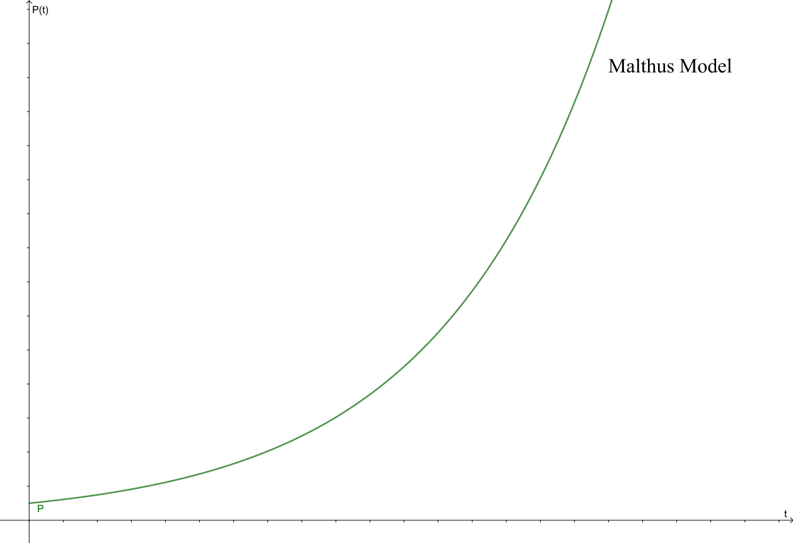

# [](https://github.com/matheussantanads/modelagem-matematica/tree/master/Crescimento%20Populacional%20(EDO)#crescimento-populacional-equa%C3%A7%C3%A3o-diferencial-ordin%C3%A1ria) [](https://github.com/matheussantanads/modelagem-matematica/tree/master/Crescimento%20Populacional%20(EDO)#population-growth-ordinary-differential-equation)

# Crescimento Populacional (Equação Diferencial Ordinária)

Conhecendo a natureza desse fenômeno (crescimento populacional), pode-se prever a quantidade de alimento necessário para manter a população, infraestrutura, proliferação de doenças, entre outros. Observou-se que esse tipo de previsão pode ser obtido através de modelos matemáticos.

Por muito tempo buscou-se um modelo que pudesse determinar a quantidade de indivíduos (pessoas, células, animais, plantas, entre outros) em cada momento, a partir de uma população inicial. 

Começou com modelos lineares, porém tais modelos não são fies a realidade. Posteriormente surgiram modelos onde a população crescia indefinidamente, com o passar do tempo percebeu-se que tal modelo também não condiz com o que de fato acontece, assim surgiram modificações neste modelo, propiciando uma gama de modelos, cada um com sua peculiaridade, considerando ou não a limitação da população e sua extinção.

## Modelo de Malthus
Proposto por Thomas Malthus em 1798, ele observou que, na ausência de restrições ambientais a população humana aumentaria numa proporção fixa. Se  é o número de pessoas em uma certa área no instante . A hipótese de Malthus é escrita como
<p align="center"></p>

, onde  é a constante responsável pela taxa relativa de crescimento populacional.

Esse modelo considera que o crescimento da população é indefinido. Para um  suficientemente pequeno esse modelo poder ser fiel a realidade, porém quando  cresce o modelo não condiz com a realidade.

### Solução analítica

Utilizando-se do método de separação de variáveis, tem-se:
<p align="center"></p>

, onde  é uma constante de integração.

<p align="center"></p>

## Modelo de Verhulst

Tendo em vista o modelo de Malthus, sabemos que uma população não pode crescer indefinidamente, cedo ou tarde terá algum evento onde a população irá morrer, tal como o esgotamento de recursos, com isso teremos um limite para o crescimento da população.

Porposto por Pierre Verhulst em 1838, esse modelo é uma generalização do modelo de Malthus, onde as restrições do ambiente são levadas em consideração. Aqui a taxa relativa de crescimento demográfico diminui com o aumento da população, chegando a zero se uma dada população-limite (capacidade suporte) for alcançada. A hipótese de Verhulst é escrita como
<p align="center"></p>

, onde  é a constante responsável pela taxa relativa de crescimento populacional e  é a capacidade suporte dessa população.

### Solução analítica

Utilizando-se do método de separação de variáveis, tem-se:
<p align="center"></p>

, onde  é uma constante de integração.

<p align="center"></p>

## Modelo de Gompertz

Para esse modelo, acredita-se que a mortalidade tem duas causas coesistentes:
- Probabilística
- Deterioração ou Incapacidade de suportar o aumento da destruição

Esse modelo diz que uma população é limitada e não cresce exponencialmente.

Proposto por Benjamin Gompertz em 1938, esse modelo foi inicialmente pensado para descrever o crescimento de tumores, porém descreve bem o crescimento de plantas e bactérias. Aqui a taxa relativa ao crescimento é rápida no começo e lenta logo em seguida. A hipótese de Gompertz é escrita como
<p align="center"></p>

, onde  é a constante responsável pela taxa relativa de crescimento populacional e  é a capacidade suporte dessa população.

### Solução analítica

Utilizando-se do método de separação de variáveis, tem-se:
<p align="center"></p>

, onde  é uma constante de integração.

<p align="center"></p>


# Experimento Computacional

Tabela 1 - Dados demográficos do Brasil coletados pelo censo do IBGE (Instituto Brasileiro de Geografia e Estatística)

|   Ano  |   População   |    Taxa de crescimento    |
|:------:|:-------------:|:-------------------------:|
|  1872  |   9.930.478   |             -             |
|  1890  |   14.333.915  |           44,3%           |
|  1900  |   17.438.434  |           21,7%           |
|  1920  |   30.635.605  |           75,7%           |
|  1930* |  33.568.000*  |           9,57%           |
|  1940  |   41.236.315  | 34,6% (em relação a 1920) |
|  1950  |   51.944.397  |            26%            |
|  1960  |   70.992.243  |           36,7%           |
|  1970  |   94.508.583  |           33,1%           |
|  1975* |  107.508.000* |           13,75%          |
|  1980  |  121.150.573  | 28,2% (em relação a 1970) |
|  1991  |  146.917.459  |           21,3%           |
|  2000  |  169.590.693  |           15,4%           |
|  2010  |  190.755.799  |           12,5%           |
|  2018  |  208.494.900  |            9,3%           |

```* Dado retirado do livro BASSANEZI, Rodney C.;FERREIRA JR, Wilson C. Equações Diferenciais com Aplicações, São Paulo: Editora Harbra ltda, página 54.```

```Em "dados.txt" pode-se encontrar todos esses dados no formato que será utilizado no experimento.```

Parâmetros para o modelo de Verhulst e Gompertz
<p align="center"></p>

## Algoritmo

O algoritmo implementado consiste em: dado um arquivo no formato .txt com os dados referentes ao tempo e população (primeira e segunda coluna respectivamente),busca-se otimizar os valores dos parâmetros do modelo escolhido para se obter o melhor ajuste da curva aos dados experimentais. Tendo os parâmetros ajustados resolve-se a EDO com estes parâmetros, ao resolver a EDO obtemos a curva que melhor se ajusta aos dados e com isso faz-se o plot da curva e dos dados para visualização.
- [Ver implementação para o modelo de Verhulst (Clique aqui ou acesse "modelo_verhulst.py")](https://github.com/matheussantanads/modelagem-matematica/blob/master/Crescimento%20Populacional%20(EDO)/modelo_verhulst.py)
- [Ver implementação para o modelo de Gompertz (Clique aqui ou acesse "modelo_gompertz.py")](https://github.com/matheussantanads/modelagem-matematica/blob/master/Crescimento%20Populacional%20(EDO)/modelo_gompertz.py)

### Resultados/Results

#### Modelo de Verhulst

<p align="center"></p>

#### Modelo de Gompertz

<p align="center"></p>

---
# Population Growth (Ordinary Differential Equation)

Knowing the nature of this phenomenon (population growth), one can predict the amount of food needed to maintain the population, infrastructure, disease proliferation, among others. It was observed that this type of prediction can be obtained through mathematical models.

For a long time, we sought a model that could determine the amount of individuals (people, cells, animals, plants, among others) at each moment, from an initial population.

It started with linear models, but such models are not true to reality. Later models emerged where the population grew indefinitely, over time it was realized that such a model also does not match what actually happens, so there were modifications in this model, providing a range of models, each with its peculiarity, considering or not the population limitation and its extinction.

## Malthus Model
Proposed by Thomas Malthus in 1798, he noted that in the absence of environmental restrictions the human population would increase by a fixed proportion. If  is the number of people in a certain area at the moment  the Malthus hypothesis is written as
<p align = "center"> </p>

, where  is the constant responsible for the relative rate of population growth.

This model assumes that population growth is undefined. For a  Small enough this model can be true to reality, but when  grows the model does not match reality.

### Analytical Solution

Using the variable separation method, we have:
<p align="center"></p>

, where  it is a constant of integration.

<p align="center"></p>

## Verhulst Model

Given the Malthus model, we know that a population cannot grow indefinitely, sooner or later there will be some event where the population will die, such as resource depletion, so we will have a limit to population growth.

Proposed by Pierre Verhulst in 1838, this model is a generalization of the Malthus model, where environmental constraints are taken into account. Here the relative rate of population growth decreases with increasing population, reaching zero if a given limit population (carrying capacity) is reached. Verhulst's hypothesis is written as
<p align="center"></p>

, where  is the constant responsible for the relative rate of population growth and  is the support capacity of this population.

### Analytical Solution

Using the variable separation method, we have:
<p align="center"></p>

, where  it is a constant of integration.

<p align="center"></p>

## Gompertz Model

For this model, mortality is believed to have two cohesive causes:
- Probabilistic
- Deterioration or Inability to withstand increased destruction

This model says that a population is limited and does not grow exponentially.

Proposed by Benjamin Gompertz in 1938, this model was initially designed to describe tumor growth, but it describes well the growth of plants and bacteria. Here the rate of growth is rapid at first and slow afterwards. Gompertz's hypothesis is written as
<p align="center"></p>

, where  is the constant responsible for the relative rate of population growth and  is the support capacity of this population.

### Analytical solution

Using the variable separation method, we have:
<p align="center"></p>

, where  it is a constant of integration.

<p align="center"></p>

# Computational Experiment

Table 1 - Demographic data of Brazil collected by IBGE (Instituto Brasileiro de Geografia e Estatística) census

|  Year  |   Population  |        Growth rate        |
|:------:|:-------------:|:-------------------------:|
|  1872  |   9,930,478   |             -             |
|  1890  |   14,333,915  |           44.3%           |
|  1900  |   17,438,434  |           21.7%           |
|  1920  |   30,635,605  |           75.7%           |
|  1930* |  33,568,000*  |           9.57%           |
|  1940  |   41,236,315  |  34.6% (compared to 1920) |
|  1950  |   51,944,397  |            26%            |
|  1960  |   70,992,243  |           36.7%           |
|  1970  |   94,508,583  |           33.1%           |
|  1975* |  107,508,000* |           13.75%          |
|  1980  |  121,150,573  |  28.2% (compared to 1970) |
|  1991  |  146,917,459  |           21.3%           |
|  2000  |  169,590,693  |           15.4%           |
|  2010  |  190,755,799  |           12.5%           |
|  2018  |  208,494,900  |            9.3%           |

```* Data taken from the book BASSANEZI, Rodney C.;FERREIRA JR, Wilson C. Equações Diferenciais com Aplicações, São Paulo: Editora Harbra ltda, page 54.```

```In "dados.txt" you can find all this data in the format that will be used in the experiment.```

Parameters for Verhulst and Gompertz model
<p align="center"></p>

## Algorithm

The implemented algorithm consists of: given a file in .txt format with time and population data (first and second column respectively), we seek to optimize the parameter values of the chosen model to obtain the best fit of the curve to the data. experimental. Having the adjusted parameters solves the ODE with these parameters, solving the ODE we get the curve that best fits the data and with it is plotted the curve and data for visualization.
- [View implementation for Verhulst model (Click here or go to "modelo_verhulst.py")](https://github.com/matheussantanads/modelagem-matematica/blob/master/Crescimento%20Populacional%20(EDO)/modelo_verhulst.py)
- [View implementation for Gompertz model (Click here or go to "modelo_gompertz.py")](https://github.com/matheussantanads/modelagem-matematica/blob/master/Crescimento%20Populacional%20(EDO)/modelo_gompertz.py)
