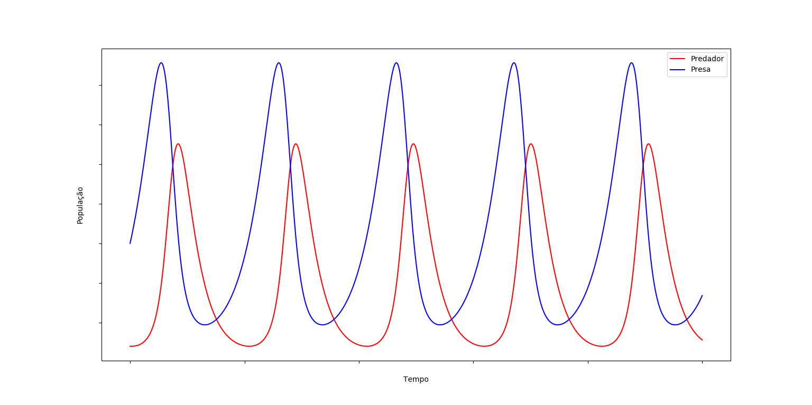
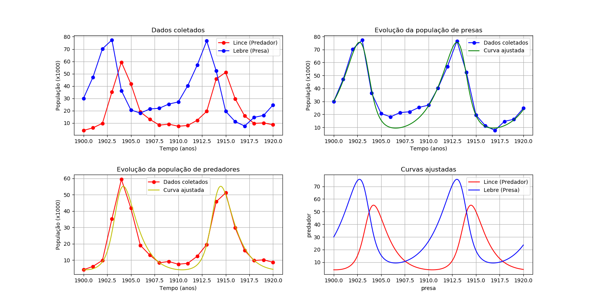
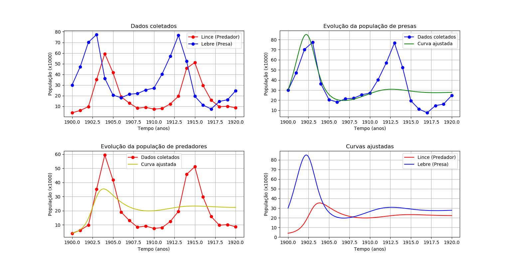
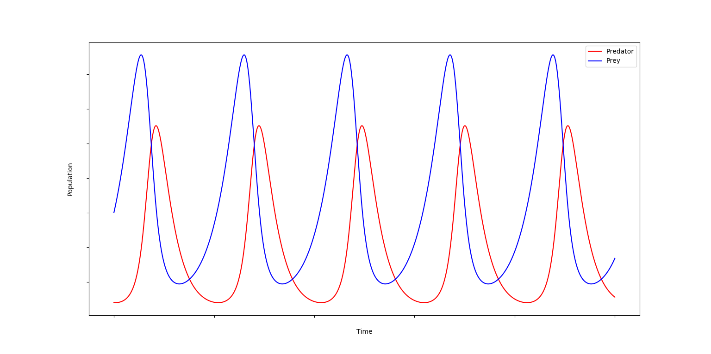

# [](https://github.com/arretado/projetos-da-universidade/tree/master/modelagem%20matem%C3%A1tica/Presa-Predador%20(EDO)#presa-predador-equa%C3%A7%C3%A3o-diferencial-ordin%C3%A1ria) [](https://github.com/arretado/projetos-da-universidade/tree/master/modelagem%20matem%C3%A1tica/Presa-Predador%20(EDO)#predator-prey-ordinary-differential-equation) 

# Presa-Predador (Equação diferencial Ordinária)

Conhecendo a natureza desse fenômeno (presa-predador), pode-se prever quantas presas ou predadores irão existir em um dado tempo, quando e se uma espécie será exinta, entre outros. Observou-se que esse tipo de previsão pode ser obtido através de modelos matemáticos.

## Modelo de Lotka-Volterra

Proposto por Alfred Lotka em 1925 e Vito Volterra em 1926, o modelo de Volterra pretendia descrever o aumento na população de uma espécie de peixe predador (e consequentemnete a dimunuição da espécie presa). O modelo de Volterra por outro lado pretendia descrever as reações químicas, nas quais as concentrações dos elementos químicos oscilavam. Estes dois modelos posteriormente serviriam de base para os modelos matemáticos utilizados para descrever um sistema do tipo Presa-Predador.
<p align="center">0\end{align*}" title="Modelo de Lotka-Volterra"/></p>

, onde  é o número de presas e  é o número de predadores.  é a taxa de crescimento da população de presas,  é a taxa de mortalidade das presas,  é a taxa de mortalidade dos predadores e  é a perícia que o predador tem em capturar a presa.

<p align="center"></p>

## Modelo de Gause

Proposto por Georgy Gause em algum momento entre 1932 e 1934, o modelo de Gause pondera o fato do crescimento da população ser limtado, seja por espaço, alimentação, recursos naturais, ou qualquer outro fator que limite o crescimento de uma população.

<p align="center">0\end{align*}" title="Modelo de Gause"/></p>

, onde  é o número de presas e  é o número de predadores.  é a capacidade suporte da população de presas,  é a capacidade suporte da população de predadores,  é a taxa de crescimento da população de presas,  é a taxa de crescimento da população de predadores,   e  são as taxas com relação ao encontro na predação da presa e do predador, respectivamente.

# Experimento Computacional

Tabela 1 - Dados coletados por Hudson's Bay Company, entre os anos de 1900 e 1920, foram feitos levantamentos sobre a quantidade de linces e lebres na região.

|  Ano | Lince (Predador) x1000 | Lebre (Presa) x1000 |
|:----:|:----------------------:|:-------------------:|
| 1900 |            4           |          30         |
| 1901 |           6,1          |         47,2        |
| 1902 |           9,8          |         70,2        |
| 1903 |          35,2          |         77,4        |
| 1904 |          59,4          |         36,3        |
| 1905 |          41,7          |         20,6        |
| 1906 |           19           |         18,1        |
| 1907 |           13           |         21,4        |
| 1908 |           8,3          |          22         |
| 1909 |           9,1          |         25,4        |
| 1910 |           7,4          |         27,1        |
| 1911 |            8           |         40,3        |
| 1912 |          12,3          |          57         |
| 1913 |          19,5          |         76,6        |
| 1914 |          45,7          |         52,3        |
| 1915 |          51,1          |         19,5        |
| 1916 |          29,7          |         11,2        |
| 1917 |          15,8          |         7,6         |
| 1918 |           9,7          |         14,6        |
| 1919 |          10,1          |         16,2        |
| 1920 |           8,6          |         24,7        |

```Esses dados foram retirados de https://www.math.tamu.edu/~phoward/m442/modbasics.pdf, página 20. Em "dados.txt" pode-se encontrar todos esses dados no formato que será utilizado no experimento.```

Parâmetros para o modelo de Lotka-Volterra
<p align="center"></p>

Parâmetros para o modelo de Gause
<p align="center"></p>

## Algoritmo
O algoritmo implementado consiste em: dado um arquivo no formato .txt com os dados referentes ao tempo, população de predadores e população de presas (primeira, segunda e terceira coluna respectivamente), busca-se otimizar os valores dos parâmetros do modelo escolhido para se obter o melhor ajuste da curva aos dados experimentais. Tendo os parâmetros ajustados resolve-se a EDO com estes parâmetros, ao resolver a EDO obtemos a curva que melhor se ajusta aos dados e com isso faz-se o plot da curva e dos dados para visualização.
- [Ver implementação para o modelo de Lotka-Volterra (Clique aqui ou acesse "modelo_lotkaVolterra.py")](https://github.com/arretado/projetos-da-universidade/tree/master/modelagem%20matem%C3%A1tica/Presa-Predador%20(EDO)/modelo_lotkaVolterra.py)
- [Ver implementação para o modelo de Gause (Clique aqui ou acesse "modelo_gause.py")](https://github.com/arretado/projetos-da-universidade/tree/master/modelagem%20matem%C3%A1tica/Presa-Predador%20(EDO)/modelo_gause.py)


### Resultados/Results

#### Modelo de Lotka-Volterra

<p align="center"></p>

#### Modelo de Gause

<p align="center"></p>

---
# Predator-Prey (Ordinary Differential Equation)

Knowing the nature of this phenomenon (predator prey), one can predict how many prey or predators will exist in a given time, when and if a species will be extinct, among others. It was observed that this type of prediction can be obtained through mathematical models.

## Lotka-Volterra Model

Proposed by Alfred Lotka in 1925 and Vito Volterra in 1926, Volterra's model was intended to describe the increase in the population of a predatory fish species (and hence the decrease in prey species). The Volterra model on the other hand was intended to describe the chemical reactions in which the concentrations of the chemical elements oscillated. These two models would later serve as the basis for the mathematical models used to describe a Prey-Predator system.
<p align="center">0\end{align*}" title="Lotka-Volterra Model"/></p>

, where  is the number of prey and  is the number of predators.  is the prey population growth rate,  is the prey mortality rate,  is the predator mortality rate and  is the predator's ability to capture prey.

<p align="center"></p>

## Gause Model

Proposed by Georgy Gause sometime between 1932 and 1934, Gause's model ponders whether population growth is constrained, whether by space, food, natural resources, or any other factor limiting population growth.

<p align="center">0\end{align*}" title="Gause Model"/></p>

, where  is the number of prey and  is the number of predators.  is the carrying capacity of the prey population,  is the carrying capacity of the predator population,  is the prey population growth rate,  is the predator population growth rate,   and  are the rates with respect to prey and predator predation, respectively.

# Computational Experiment

Table 1 - Data collected by Hudson's Bay Company, between 1900 and 1920, surveys were made on the amount of bobcats and hares in the region.

| Year |  Lynx (Predator) x1000 |  Hare (Prey) x1000  |
|:----:|:----------------------:|:-------------------:|
| 1900 |            4           |          30         |
| 1901 |           6.1          |         47.2        |
| 1902 |           9.8          |         70.2        |
| 1903 |          35.2          |         77.4        |
| 1904 |          59.4          |         36.3        |
| 1905 |          41.7          |         20.6        |
| 1906 |           19           |         18.1        |
| 1907 |           13           |         21.4        |
| 1908 |           8.3          |          22         |
| 1909 |           9.1          |         25.4        |
| 1910 |           7.4          |         27.1        |
| 1911 |            8           |         40.3        |
| 1912 |          12.3          |          57         |
| 1913 |          19.5          |         76.6        |
| 1914 |          45.7          |         52.3        |
| 1915 |          51.1          |         19.5        |
| 1916 |          29.7          |         11.2        |
| 1917 |          15.8          |         7.6         |
| 1918 |           9.7          |         14.6        |
| 1919 |          10.1          |         16.2        |
| 1920 |           8.6          |         24.7        |

```These data were taken from https://www.math.tamu.edu/~phoward/m442/modbasics.pdf, page 20. In "dados.txt" you can find all this data in the format that will be used in the experiment.```

Parameters for the Lotka-Volterra model
<p align="center"></p>

Parameters for the Gause model
<p align="center"></p>

## Algorithm

The implemented algorithm consists of: given a file in .txt format with data related to time, predator population and prey population (first, second and third column respectively), we seek to optimize the parameter values of the model chosen to be used. get the best fit of the curve to the experimental data. Having the adjusted parameters solves the ODE with these parameters, solving the ODE we get the curve that best fits the data and with it is plotted the curve and data for visualization.
- [View implementation for Lotka-Volterra model (Click here or go to "modelo_lotkaVolterra.py")](https://github.com/arretado/projetos-da-universidade/tree/master/modelagem%20matem%C3%A1tica/Presa-Predador%20(EDO)/modelo_lotkaVolterra.py)
- [View implementation for Gause model (Click here or go to "modelo_gause.py")](https://github.com/arretado/projetos-da-universidade/tree/master/modelagem%20matem%C3%A1tica/Presa-Predador%20(EDO)/modelo_gause.py)